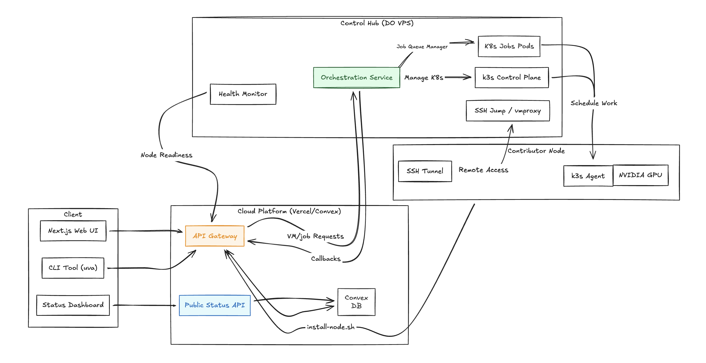

# uvacompute

Instant GPU-powered virtual machines and container jobs, managed through a CLI and web dashboard. Built on Kubernetes (KubeVirt) with real-time status via Convex.

## Architecture



- **CLI** (`uva`) — TypeScript/Bun binary. Authenticates via device flow, talks to the site API.
- **Site** — Next.js app (Vercel) serving the web dashboard and API gateway, backed by Convex for real-time data.
- **Status** — Separate Next.js app for uptime monitoring and cluster health, backed by Redis.
- **VM Orchestration Service** — Go service running on the workstation node. Manages KubeVirt VMs and Kubernetes jobs.
- **Hub** — VPS acting as an SSH proxy/tunnel endpoint (via autossh) and handling HTTPS endpoint exposure (via Caddy + FRP).
- **Workstation Node** — The actual compute. Runs k3s + KubeVirt for VM/job execution, connected to the hub via Tailscale.

**Data flow:** CLI → Site API (Vercel) → VM Orchestration Service (workstation) → Kubernetes (KubeVirt VMs / Jobs)

## Self-Hosting

uvacompute is fully self-hostable. You'll need:

- A **VPS** (e.g. DigitalOcean droplet) to act as the hub/SSH proxy
- A **workstation** with GPU(s) running Linux, k3s, KubeVirt, and the NVIDIA GPU Operator
- Accounts for **Vercel**, **Convex**, **Cloudflare** (DNS), and **Resend** (email)
- GitHub OAuth apps for authentication

See the `.env.example` files in each app for required environment variables.

### Prerequisites

- [pnpm](https://pnpm.io) — JS package manager
- [Bun](https://bun.sh) — CLI runtime
- [Go](https://go.dev) — orchestration service
- [Vercel CLI](https://vercel.com/docs/cli) — site/status deployment
- [Convex CLI](https://docs.convex.dev/cli) — backend
- [Tailscale](https://tailscale.com) — node connectivity
- `make` — orchestration service installation

### Setup

```bash
# Install dependencies
pnpm install

# Configure environment variables (copy and fill in each .env.example)
cp apps/site/.env.example apps/site/.env.local
cp apps/status/.env.example apps/status/.env.local
cp apps/vm-orchestration-service/.env.example apps/vm-orchestration-service/.env.production

# Run the site locally
cd apps/site
pnpm dev          # in one terminal
npx convex dev    # in another terminal

# Run the status page locally (port 3001)
cd apps/status
pnpm dev
```

## Apps

### `apps/site`

Next.js web dashboard and API gateway.

- VM and container job management UI
- API routes proxying to the orchestration service
- Device authorization flow for CLI auth (Better Auth)
- Real-time updates via Convex
- SSH key management

### `apps/status`

Status page showing infrastructure health and uptime.

- System status (operational / degraded / down)
- Response time tracking and uptime percentages
- 30-day historical data

### `apps/cli`

The `uva` CLI. TypeScript/Bun compiled to a standalone binary.

```
uva login / logout          # authentication
uva vm create/list/ssh/stop # VM management
uva jobs run/ls/logs/cancel # container job management
uva ssh-keys add/list/rm    # SSH key management
uva upgrade / uninstall     # CLI management
```

Run locally with `bun run index.ts [commands]` (dev mode — won't create real VMs unless the orchestration service is running).

### `apps/vm-orchestration-service`

Go service orchestrating VM and job lifecycle via Kubernetes.

- KubeVirt VM creation with cloud-init (SSH keys, startup scripts)
- Kubernetes Jobs with GPU support
- Health monitoring and state reconciliation with Convex
- FRP client integration for SSH tunneling through the hub

**Workstation requirements:** k3s, KubeVirt, NVIDIA GPU Operator, CDI, Tailscale. See the Makefile for installation targets (`make install-kubevirt-stack`, etc).

## Deployment

| App                             | Method                                                            |
| ------------------------------- | ----------------------------------------------------------------- |
| `apps/site`                     | Auto-deploys to Vercel on push to `main`                          |
| `apps/status`                   | Auto-deploys to Vercel on push to `main`                          |
| `apps/cli`                      | Binaries built on push/PR; releases are manual via GitHub Actions |
| `apps/vm-orchestration-service` | Manual deploy to workstation (`sudo make install`)                |
| Hub (VPS)                       | `make deploy-hub` from `apps/vm-orchestration-service`            |

## Examples

See [`examples/JOBS.md`](examples/JOBS.md) for container job examples including GPU tests, vLLM inference servers, and more.

## Roadmap

- [ ] Upgrade/downgrade vCPUs and storage on running instances
- [ ] Observability and usage analytics
- [ ] Multi-GPU support (2+ GPUs per VM/job)
- [ ] Interactive notebooks (Modal-style)
- [x] ~~Multi-node federation (community-contributed compute)~~
- [x] ~~KubeVirt migration (from Incus)~~
- [x] ~~Container jobs with live log streaming~~
- [x] ~~CLI man page~~
- [x] ~~BYO startup scripts~~

## Contributing

1. Fork the repo and create a feature branch
2. Copy `.env.example` files and configure your environment
3. Make your changes and ensure tests pass (`go test ./...` for the orchestration service)
4. Open a pull request against `main`

## License

See [LICENSE](LICENSE) for details.
